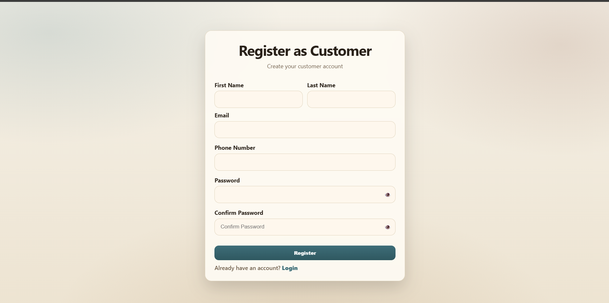
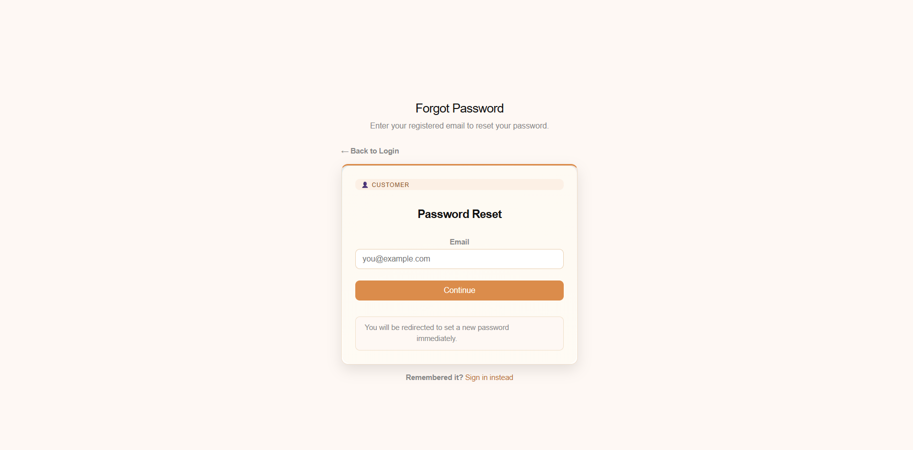
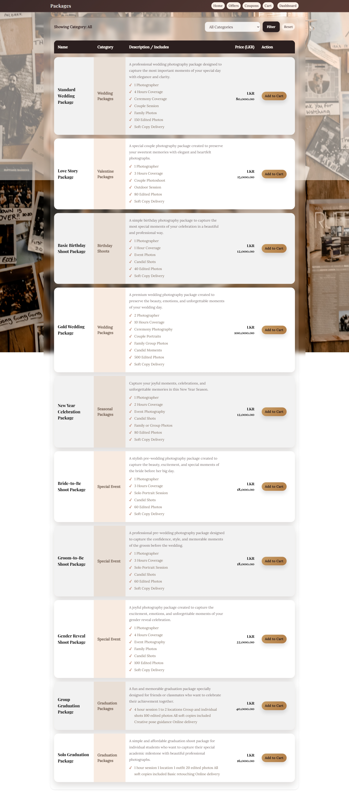
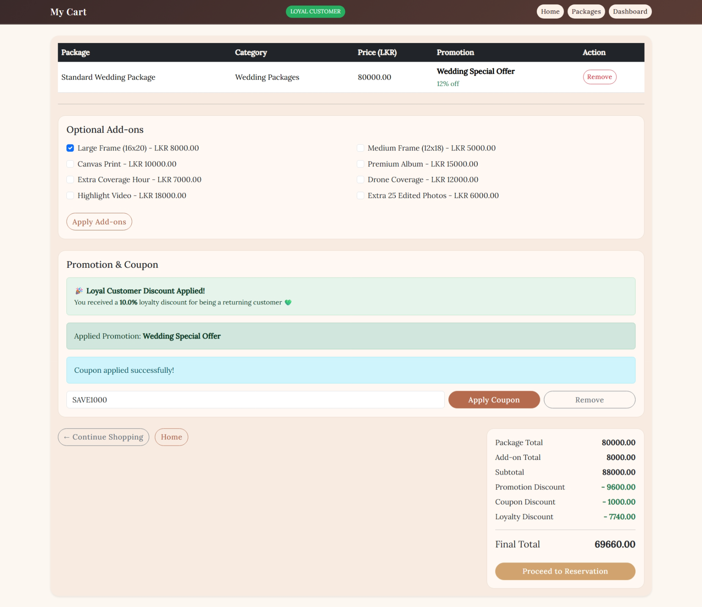
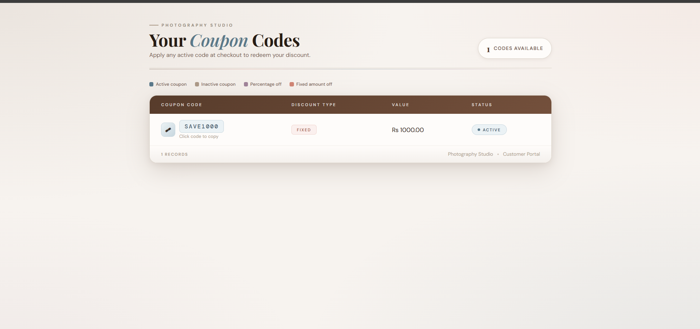
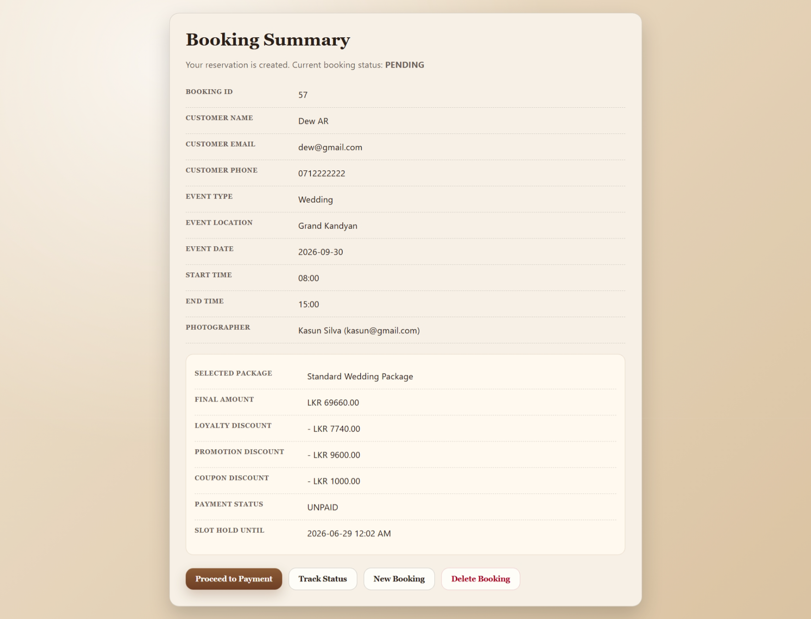
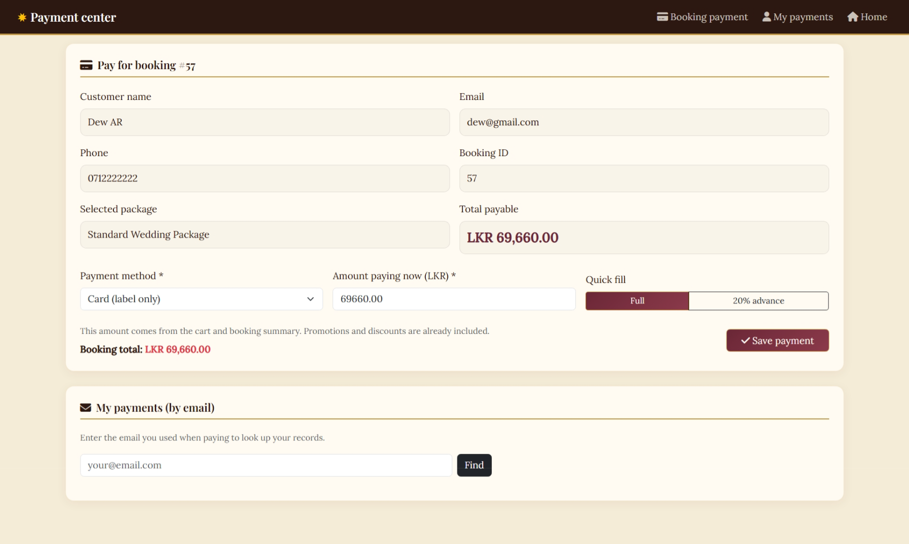

<h1 align="center">📸 Web-Based Photography Booking and Management System</h1>

> A comprehensive web-based platform developed to streamline photography service booking, customer management, payment processing, marketing campaigns, and photographer scheduling through an integrated management system.

<p align="center">
  
</p>


---

# 📖 Project Overview

The **Web-Based Photography Booking and Management System** is a full-stack enterprise web application developed to digitalize photography service management.

The system enables customers to browse photography packages, make reservations, apply promotional discounts, complete online payments, and track bookings, while providing administrators with powerful tools to manage users, photographers, packages, promotions, loyalty discounts, payments, and reports.

This project was developed as the **Year 2 Semester 2 Information Systems Project (IE2091)** for the **BSc (Hons) in Information Technology – Information Systems Engineering** degree program at the **Sri Lanka Institute of Information Technology (SLIIT)**.

---

# ✨ Key Features

## 👤 User Management

* Customer Registration & Login
* Photographer Management
* Administrator Dashboard
* Role-Based Authentication
* User Profile Management
* Account Activation / Deactivation
* Secure Password Encryption

---

## 📦 Photography Package Management

* Photography Category Management
* Package Management
* Package Filtering
* Shopping Cart
* Add-on Selection
* Cart Summary
* Automatic Price Calculation

---

## 📅 Booking Management

* Online Reservation System
* Photographer Assignment
* Photographer Availability Validation
* Double Booking Prevention
* Booking Approval & Rejection
* Booking Tracking
* Booking Calendar

---

## 💳 Payment Management

* Full Payment
* Advance Payment
* Remaining Balance Payment
* PDF Receipt Generation
* Payment History
* Revenue Reports
* Payment Status Tracking

---

## 🎯 Marketing Management

* Promotion Management
* Coupon Management
* Loyalty Discount System
* Promotion Countdown
* Automatic Discount Calculation
* Promotional Image Upload

---

## ⭐ Loyalty Discount Feature

One of the unique business features of this project.

Customers who complete **three or more paid bookings** are automatically recognized as **Loyal Customers**.

The system:

* Detects loyalty automatically
* Applies configurable loyalty discounts
* Combines loyalty discounts with promotions and coupons
* Calculates the final payable amount automatically
* Allows administrators to modify loyalty percentages without changing the source code

---

## 📝 Feedback Management

* Customer Feedback Submission
* Rating System
* Feedback Moderation
* Feedback Display

---

## 🔒 Security Features

* Spring Security Authentication
* Role-Based Authorization
* Password Encryption (BCrypt)
* CSRF Protection
* Session Management
* Input Validation
* Secure Route Protection

---

# 🏗 System Architecture

```
Presentation Layer
│
├── Thymeleaf Templates
├── Bootstrap UI
│
Controller Layer
│
├── User Controller
├── Booking Controller
├── Package Controller
├── Payment Controller
├── Marketing Controller
│
Service Layer
│
├── Business Logic
├── Validation
├── Discount Calculations
│
Repository Layer
│
├── Spring Data JPA
│
Database
│
└── MySQL
```

---

# 🏛 Modules

* User Management
* Photography Package Management
* Booking Management
* Payment Management
* Marketing Management
* Feedback Management

---
# 🖼️ System Screenshots

## Home Page

<p align="center">
  
</p>

---
## Customer Registration

<p align="center">
  
</p>

<p align="center">
  
</p>

---

## Photography Packages

<p align="center">
  
</p>

---

## Shopping Cart

<p align="center">
  
</p>

---

## Marketing Management

<p align="center">
  
</p>

<p align="center">
  
</p>

---

## Booking Management

<p align="center">
  
</p>

---

## Payment Management

<p align="center">
  
</p>

---
# ⭐ Special Business Features

## Loyalty Discount System

Automatically rewards returning customers by detecting completed bookings and applying configurable loyalty discounts.

---

## Promotion Engine

* Category-based promotions
* Countdown campaigns
* Automatic promotion calculation

---

## Coupon System

* Percentage Discounts
* Fixed Amount Discounts
* Coupon Validation
* Coupon Expiration
* Active/Inactive Coupons

---

## Photographer Availability Validation

Automatically prevents:

* Double bookings
* Schedule conflicts
* Invalid photographer assignments

---

# 🛠 Technology Stack

| Technology      | Description                    |
| --------------- | ------------------------------ |
| Java 17         | Programming Language           |
| Spring Boot     | Backend Framework              |
| Spring Security | Authentication & Authorization |
| Hibernate / JPA | ORM Framework                  |
| Thymeleaf       | Server-side Templating         |
| Bootstrap 5     | Frontend UI                    |
| HTML5           | Frontend                       |
| CSS3            | Styling                        |
| JavaScript      | Client-side Interactions       |
| MySQL           | Database                       |
| Maven           | Dependency Management          |
| IntelliJ IDEA   | Development Environment        |

---

# 📂 Project Structure

```
src
├── booking_management
├── feedback_management
├── marketing_management
│   ├── coupon
│   ├── promotion
│   └── discounts
├── package_management
├── payment_management
├── user_management
├── config
├── security
├── repository
├── service
└── templates
```

---

# 🗄 Database Tables

### User Management

* users
* roles

### Photography Package Management

* category
* package
* cart
* add_on

### Booking Management

* booking
* booking_summary
* photographer_assignment

### Marketing Management

* promotion
* coupon
* loyalty_discount

### Payment Management

* payment

### Feedback Management

* feedback

---

# 📸 System Screenshots

Include screenshots such as:

* Home Page
* Customer Dashboard
* Package Management
* Shopping Cart
* Booking Page
* Photographer Assignment
* Loyalty Discount
* Promotion Management
* Coupon Management
* Payment Page
* Receipt Generation
* Admin Dashboard
* Feedback Module

---

# 🚀 Installation

Clone the repository

```bash
git clone https://github.com/yourusername/Photography-Booking-Management-System.git
```

Open the project

```bash
cd Photography-Booking-Management-System
```

Configure the database in:

```
application.properties
```

Run the project

```bash
mvn spring-boot:run
```

Open

```
http://localhost:8080
```

---

# 👥 Team Members

1. IT24103653 - Rodrigo H.A.D.A (Me)
2. IT24100636 - Fernando T.M.I.U
3. IT24100151 - Ruth R.W.N
4. IT24101144 - Jayaweera S.R.S.H
5. IT24101905 - Chamya J.A

---

# 🎓 Academic Information

**Module:** Information Systems Project (IE2091)

**Institution:** Sri Lanka Institute of Information Technology (SLIIT)

**Academic Year:** Year 2 Semester 2 (2026)

---

# 🏆 Project Highlights

* ✅ Complete Enterprise Web Application
* ✅ Six Fully Integrated Modules
* ✅ Spring Security Authentication
* ✅ Role-Based Authorization
* ✅ Loyalty Discount System
* ✅ Promotion & Coupon Engine
* ✅ Photographer Availability Validation
* ✅ Secure Payment Management
* ✅ Responsive User Interface
* ✅ MVC Architecture
* ✅ Hibernate/JPA Integration
* ✅ MySQL Database
* ✅ Real-world Business Workflow


